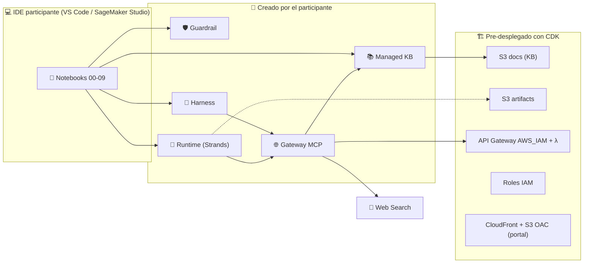

# 🤖 Agentic AI en AWS · Workshop Hands-On (parametrizable para cualquier cliente)

Workshop de **~2 horas** en el que los participantes construyen, paso a paso, un agente que **evoluciona** en cada módulo: de un LLM que solo habla, a un agente productivo con **Guardrails, RAG, herramientas MCP gobernadas y despliegue serverless en Amazon Bedrock AgentCore**.

Todo está **parametrizado para cualquier cliente**: `infrastructure/cdk.json` tiene valores genéricos, un `.env` local (git-ignored) define el cliente y su *customer pack* (`customers/<id>/`, también git-ignored) aporta documentos, datos y prompts. El repo incluye el pack genérico `acme` (agente **AgentBot**).

- 🌐 **Portal del workshop:** output `CloudFrontURL` del stack `<prefijo>-portal-<env>` (CloudFront, dominio por defecto, sin DNS custom)
- 📓 **Notebooks:** `workshop/00_setup` → `workshop/09_runtime_gateway_rag` (+ `99_cleanup`)
- 🏛️ **Diagramas draw.io + PNG (DPI-400):** `assets/diagrams/`


---

## 🧬 La evolución del agente (agenda de 2 horas)

| # | Nivel | Módulo | Servicios | ⏱️ |
|---|---|---|---|---|
| 00 | 🥚 Huevo | [Preparar el entorno](workshop/00_setup/) | STS, Bedrock, CloudFormation | 5 |
| 01 | 🐣 Bebé | [Bedrock: input/output de un LLM](workshop/01_bedrock_llms/) | Converse / ConverseStream | 10 |
| 02 | 🧠 Explorador | [OpenAI Sol/Terra/Luna vs Claude Haiku/Sonnet/Opus](workshop/02_model_battle/) | Bedrock (6 modelos) + LLM-as-a-Judge | 10 |
| 03 | 🛡️ Guardián | [Amazon Bedrock Guardrails](workshop/03_guardrails/) | Guardrails STANDARD, ApplyGuardrail | 15 |
| 04 | 📚 Sabio | [RAG con Managed Knowledge Base](workshop/04_rag_knowledge_bases/) | Managed KB, Agentic Retrieval | 15 |
| 05 | 🤖 Autónomo | [AgentCore Harness](workshop/05_agentcore_harness/) | Harness, Code Interpreter, Memory | 15 |
| 06 | 🌐 Conectado | [AgentCore Gateway (MCP) + Web Search](workshop/06_gateway_websearch/) | Gateway, Web Search connector | 10 |
| 07 | 🚀 Productivo | [Strands Agents en AgentCore Runtime](workshop/07_runtime_strands/) | Runtime (direct code deploy), Strands | 15 |
| 08 | 🏦 Banquero | [Runtime + Gateway + API backend](workshop/08_runtime_gateway_api/) | API Gateway (AWS_IAM) + Lambda como tools MCP | 10 |
| 09 | 🦸 Leyenda | [Runtime + Gateway + RAG + Guardrails](workshop/09_runtime_gateway_rag/) | KB connector, ApplyGuardrail como capa | 10 |
| 99 | 🧹 | [Limpieza](workshop/99_cleanup/) | — | — |

---

## 🏗️ Arquitectura



**División de responsabilidades**

- **CDK (facilitador, 1 vez por cuenta):** lo lento o con mucho IAM → buckets privados, API bancaria ficticia, roles least-privilege con protección *confused deputy*, portal.
- **Notebooks (participantes):** los recursos de IA, para aprender creándolos → Guardrail, Knowledge Base, Harness, Gateway + targets, Runtime (3 versiones).

**Seguridad aplicada:** buckets privados (sin website hosting) + CloudFront OAC, API solo con IAM/SigV4 (sin Lambda Function URLs), cero Security Groups abiertos, sin secretos en el repo (`.env` es git-ignored y no contiene secretos).

---

## 🚀 Inicio rápido

### Facilitador: desplegar en una cuenta

```bash
git clone https://github.com/san99tiago/aws-agentic-ai-fundamentals-workshop.git
cd aws-agentic-ai-fundamentals-workshop
cp .env.example .env          # edita los valores del cliente
make install                  # Poetry (.venv en la raíz) + npm
make deploy                   # cdk bootstrap (si hace falta) + deploy foundation + portal
```

### Facilitador: muchas cuentas de workshop

```bash
# Un perfil de AWS CLI por cuenta; el portal se despliega solo en la primera
make deploy-accounts PROFILES="team01 team02 team03"
```

### Participante

```bash
git clone <repo> && cd aws-agentic-ai-fundamentals-workshop
cp .env.example .env          # valores que comparte el facilitador
poetry install                # o en SageMaker Studio: pip install -r requirements.txt
jupyter lab workshop/         # abre 00_setup.ipynb y sigue en orden
```

Requisitos: credenciales AWS en `us-east-1`, Python 3.12+, Node 22+ (solo para el portal), [draw.io desktop](https://www.drawio.com/) (solo para regenerar diagramas).

---

## ⚙️ Parametrización multi-cliente

| Archivo | Rol |
|---|---|
| `infrastructure/cdk.json` | Valores **genéricos** por ambiente (`app_config.dev/prod`) |
| `.env` (git-ignored) | Valores del cliente; `KEY` en mayúsculas sobrescribe `key` de `cdk.json` |
| `customers/<CUSTOMER_ID>/` | Customer pack: `customer.json` (persona, prompts por módulo, guardrail), `knowledge-base/*.md`, `banking-api-data.json` |
| `/config.json` del portal | Generado por CDK desde los mismos parámetros (branding sin rebuild) |

El repo versiona solo el pack genérico `acme`; los packs de clientes reales quedan locales (git-ignored). Guía completa: [docs/customization.md](docs/customization.md).

---

## 📁 Estructura

```
├── .env.example                 # parámetros del cliente (copiar a .env)
├── customers/acme/              # customer pack genérico (los demás packs son locales)
├── infrastructure/              # AWS CDK (Python): foundation + portal, tests
├── workshop/
│   ├── common/                  # workshop_kit.py, runtime_deployer.py
│   ├── 00_setup … 09_runtime_gateway_rag/   # .ipynb + .py + README + architecture.png
│   └── 99_cleanup/
├── frontend/                    # portal React (Vite) interactivo
├── assets/diagrams/             # build_diagrams.py, *.drawio, png/ (DPI-400)
├── docs/                        # guía del facilitador y personalización
├── scripts/                     # deploy.sh, deploy_multi_account.sh, destroy.sh
└── Makefile
```

---

## 🧪 Validación

- Los 10 módulos se ejecutaron de punta a punta contra AWS (us-east-1) el 2026-10-07.
- `make test` corre los tests de CDK con aserciones de seguridad: buckets privados, API con IAM, sin Function URLs, trust policies con condiciones, CloudFront con OAC.
- Lecciones aprendidas en la validación: ver [docs/facilitator-guide.md](docs/facilitator-guide.md#lecciones-aprendidas).

---

## 🧹 Limpieza

```bash
make cleanup    # recursos de IA creados en los notebooks
make destroy    # + stacks CDK
```

# LICENSE

Copyright 2026 Santiago Garcia Arango. Licenciado bajo [Apache 2.0](LICENSE).
