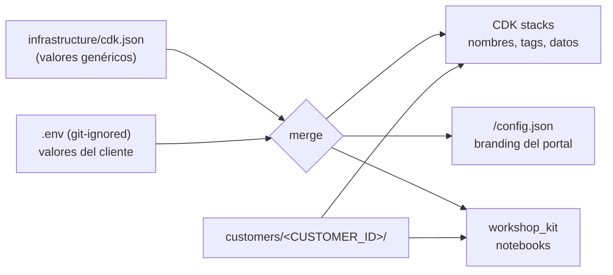

# ⚙️ Personalizar el workshop para otro cliente



## 1. Crear el customer pack

```bash
cp -R customers/acme customers/<nuevo-cliente>
```

| Archivo | Qué editar |
|---|---|
| `customer.json` | `agent_persona`, `secret_context` (demo de fuga, ficticio), `examples` (prompt por módulo), `guardrail` (denied topics, palabras, regex PII) |
| `knowledge-base/*.md` | Documentos para RAG (FAQs). Marca los datos como ficticios |
| `banking-api-data.json` | Datos mock de la API (clientes, productos, tasas) |

Placeholders disponibles en `customer.json`: `{agent_name}`, `{customer_brand}`, `{customer_name}`.

## 2. Configurar `.env`

```bash
cp .env.example .env
# CUSTOMER_ID=<nuevo-cliente>  RESOURCE_PREFIX=<prefijo-corto>  AGENT_NAME=...  PRIMARY_COLOR=...
```

`RESOURCE_PREFIX` debe tener entre 3 y 31 caracteres (minúsculas, números y guiones). Se usa para nombrar todos los recursos, y se puede desplegar más de un cliente en la misma cuenta usando prefijos distintos.

## 3. Desplegar y validar

```bash
make deploy
make test
poetry run python workshop/00_setup/00_setup.py
```

## 4. (Opcional) Diagramas y portal

- `make diagrams` regenera los `.drawio` y los PNG (los títulos son genéricos).
- El portal toma nombre, colores y emoji de `/config.json`, así que no hace falta recompilarlo para otro cliente.

# LICENSE

Copyright 2026 Santiago Garcia Arango
