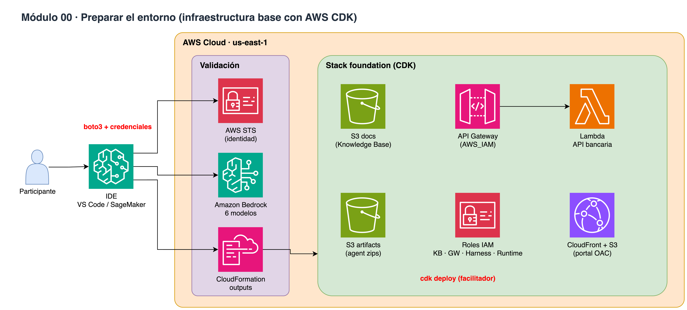

# Módulo 00 · 🥚 Preparar el entorno

⏱️ **5 minutos** · Validar credenciales, acceso a los 6 modelos de Bedrock y los outputs del stack foundation.



> Diagrama editable: [`assets/diagrams/00-setup.drawio`](../../assets/diagrams/00-setup.drawio) · Portal: sección **Módulo 00**.

## Archivos

- `00_setup.ipynb` / `00_setup.py`

## Paso a paso

1. Credenciales AWS en us-east-1
2. Ver los parámetros del cliente (cdk.json + .env)
3. Ver outputs del stack CDK
4. Probar los 6 modelos con maxTokens=50

## Cómo ejecutarlo

```bash
# Jupyter (VS Code / SageMaker Studio): abre el .ipynb y ejecuta celda por celda
# o como script desde la raíz del repo:
poetry run python workshop/00_setup/00_setup.py
```

Los recursos que crees se guardan en `workshop/.state.json` para el siguiente módulo y para `99_cleanup`.

# LICENSE

Copyright 2026 Santiago Garcia Arango
