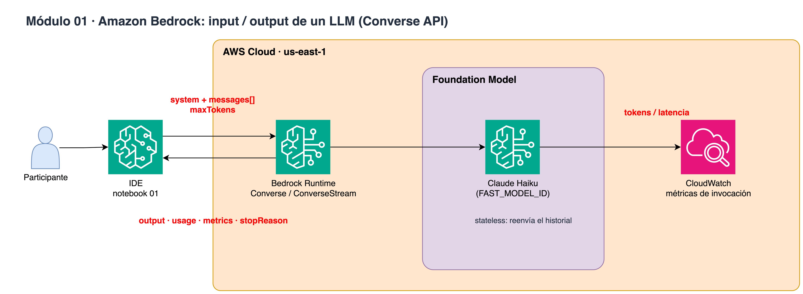

# Módulo 01 · 🐣 Amazon Bedrock: input / output de un LLM

⏱️ **10 minutos** · Mensajes, system prompt, tokens, latencia, multi-turno, JSON y streaming con la Converse API.



> Diagrama editable: [`assets/diagrams/01-bedrock-llms.drawio`](../../assets/diagrams/01-bedrock-llms.drawio) · Portal: sección **Módulo 01**.

## Archivos

- `01_bedrock_llms.ipynb` / `.py`

## Paso a paso

1. Primera llamada Converse y anatomía de la respuesta
2. System prompt (personalidad del agente)
3. Multi-turno: el modelo es stateless
4. Salida estructurada JSON
5. Streaming con converse_stream

## Cómo ejecutarlo

```bash
# Jupyter (VS Code / SageMaker Studio): abre el .ipynb y ejecuta celda por celda
# o como script desde la raíz del repo:
poetry run python workshop/01_bedrock_llms/01_bedrock_llms.py
```

Los recursos que crees se guardan en `workshop/.state.json` para el siguiente módulo y para `99_cleanup`.

# LICENSE

Copyright 2026 Santiago Garcia Arango
