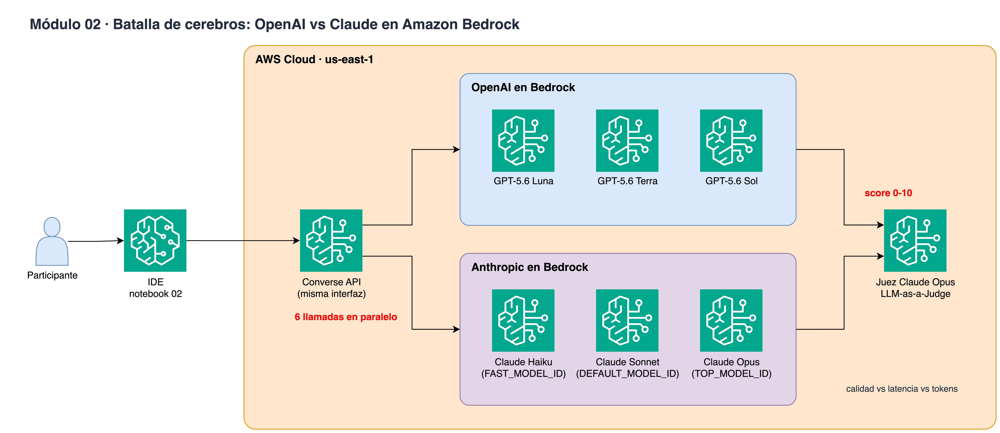

# Módulo 02 · 🧠 Batalla de cerebros: OpenAI vs Claude

⏱️ **10 minutos** · GPT-5.6 Luna/Terra/Sol vs Claude Haiku 4.5/Sonnet 5.5/Opus 5.5 con la misma API, evaluados por un LLM-as-a-Judge.



> Diagrama editable: [`assets/diagrams/02-model-battle.drawio`](../../assets/diagrams/02-model-battle.drawio) · Portal: sección **Módulo 02**.

## Archivos

- `02_model_battle.ipynb` / `.py`

## Paso a paso

1. 6 modelos en paralelo con la misma pregunta
2. Juez Opus 5.5 con rúbrica (base de AgentCore Evaluations)
3. Tabla calidad vs latencia vs tokens

## Cómo ejecutarlo

```bash
# Jupyter (VS Code / SageMaker Studio): abre el .ipynb y ejecuta celda por celda
# o como script desde la raíz del repo:
poetry run python workshop/02_model_battle/02_model_battle.py
```

Los recursos que crees se guardan en `workshop/.state.json` para el siguiente módulo y para `99_cleanup`.

# LICENSE

Copyright 2026 Santiago Garcia Arango
