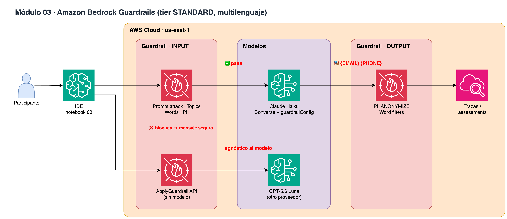

# Módulo 03 · 🛡️ Amazon Bedrock Guardrails

⏱️ **15 minutos** · Prompt attacks, denied topics, word filters y PII (BLOCK / ANONYMIZE) con el tier STANDARD (multilenguaje).



> Diagrama editable: [`assets/diagrams/03-guardrails.drawio`](../../assets/diagrams/03-guardrails.drawio) · Portal: sección **Módulo 03**.

## Archivos

- `03_guardrails.ipynb` / `.py`

## Paso a paso

1. Atacar al agente SIN guardrails
2. Crear el guardrail (crossRegionConfig us.guardrail.v1:0)
3. Mismos ataques CON guardrail
4. ApplyGuardrail: qué política actuó
5. PII ANONYMIZE en la salida
6. Mismo guardrail con un modelo OpenAI

## Cómo ejecutarlo

```bash
# Jupyter (VS Code / SageMaker Studio): abre el .ipynb y ejecuta celda por celda
# o como script desde la raíz del repo:
poetry run python workshop/03_guardrails/03_guardrails.py
```

Los recursos que crees se guardan en `workshop/.state.json` para el siguiente módulo y para `99_cleanup`.

# LICENSE

Copyright 2026 Santiago Garcia Arango
