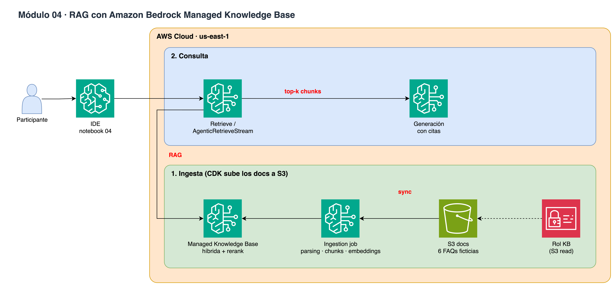

# Módulo 04 · 📚 RAG con Bedrock Managed Knowledge Base

⏱️ **15 minutos** · Knowledge Base 100% gestionada (sin vector store): ingesta desde S3, Retrieve y Agentic Retrieval con citas.



> Diagrama editable: [`assets/diagrams/04-rag.drawio`](../../assets/diagrams/04-rag.drawio) · Portal: sección **Módulo 04**.

## Archivos

- `04_rag_knowledge_bases.ipynb` / `.py`

## Paso a paso

1. Sin RAG el modelo no conoce los productos
2. Crear Managed KB + data source S3
3. Ingesta (~2-3 min)
4. Retrieve: chunks + score
5. AgenticRetrieveStream: planeación multi-paso + respuesta
6. RAG manual con Converse

## Cómo ejecutarlo

```bash
# Jupyter (VS Code / SageMaker Studio): abre el .ipynb y ejecuta celda por celda
# o como script desde la raíz del repo:
poetry run python workshop/04_rag_knowledge_bases/04_rag_knowledge_bases.py
```

Los recursos que crees se guardan en `workshop/.state.json` para el siguiente módulo y para `99_cleanup`.

# LICENSE

Copyright 2026 Santiago Garcia Arango
