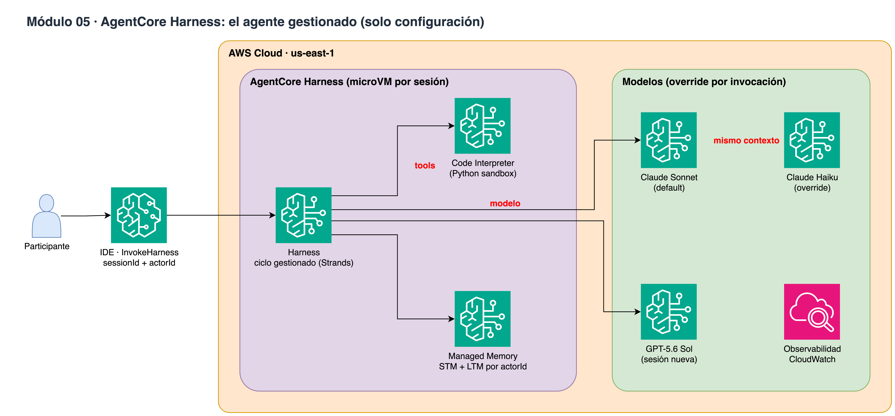

# Módulo 05 · 🤖 AgentCore Harness

⏱️ **15 minutos** · Agente gestionado solo con configuración: modelo, instrucciones, Code Interpreter, memoria y límites.



> Diagrama editable: [`assets/diagrams/05-harness.drawio`](../../assets/diagrams/05-harness.drawio) · Portal: sección **Módulo 05**.

## Archivos

- `05_agentcore_harness.ipynb` / `.py`

## Paso a paso

1. create_harness (¡ese es todo el código!)
2. invoke_harness con sessionId + actorId
3. El agente usa Code Interpreter
4. Estado de sesión y cambio de modelo sin redeploy
5. Aislamiento por usuario y memoria de largo plazo

## Cómo ejecutarlo

```bash
# Jupyter (VS Code / SageMaker Studio): abre el .ipynb y ejecuta celda por celda
# o como script desde la raíz del repo:
poetry run python workshop/05_agentcore_harness/05_agentcore_harness.py
```

Los recursos que crees se guardan en `workshop/.state.json` para el siguiente módulo y para `99_cleanup`.

# LICENSE

Copyright 2026 Santiago Garcia Arango
