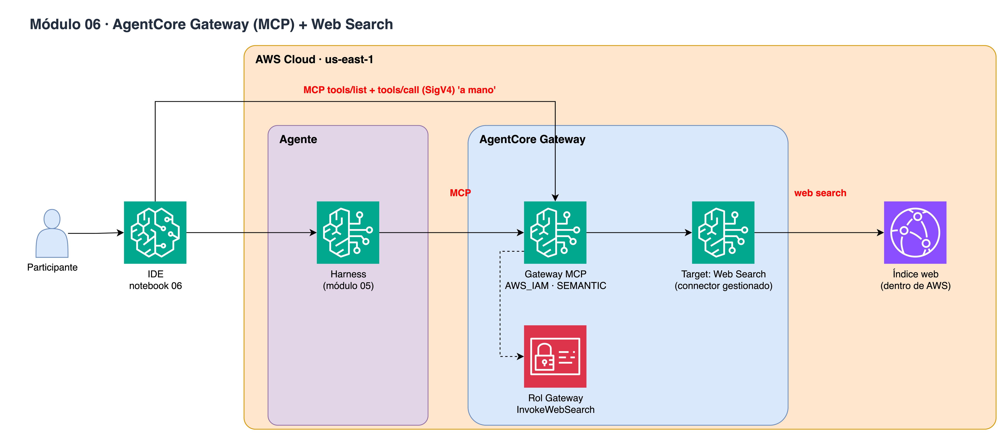

# Módulo 06 · 🌐 AgentCore Gateway (MCP) + Web Search

⏱️ **10 minutos** · Gateway MCP con autenticación AWS_IAM y el connector gestionado de Web Search, conectado al Harness.



> Diagrama editable: [`assets/diagrams/06-gateway-websearch.drawio`](../../assets/diagrams/06-gateway-websearch.drawio) · Portal: sección **Módulo 06**.

## Archivos

- `06_gateway_websearch.ipynb` / `.py`

## Paso a paso

1. create_gateway (MCP, AWS_IAM, búsqueda semántica)
2. Target connector web-search
3. MCP 'a mano' con SigV4 (tools/list, tools/call)
4. Conectar el Gateway al Harness
5. El agente busca en la web y cita fuentes

## Cómo ejecutarlo

```bash
# Jupyter (VS Code / SageMaker Studio): abre el .ipynb y ejecuta celda por celda
# o como script desde la raíz del repo:
poetry run python workshop/06_gateway_websearch/06_gateway_websearch.py
```

Los recursos que crees se guardan en `workshop/.state.json` para el siguiente módulo y para `99_cleanup`.

# LICENSE

Copyright 2026 Santiago Garcia Arango
