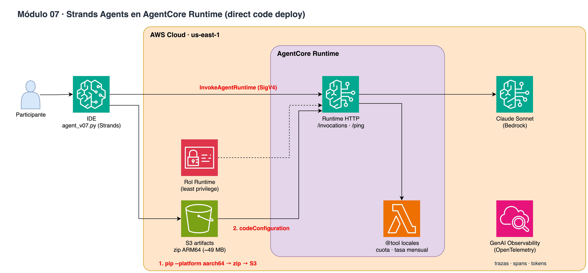

# Módulo 07 · 🚀 Strands Agents en AgentCore Runtime

⏱️ **15 minutos** · Agente propio con Strands (@tool), prueba local y despliegue de código directo (zip ARM64, sin Docker).



> Diagrama editable: [`assets/diagrams/07-runtime-strands.drawio`](../../assets/diagrams/07-runtime-strands.drawio) · Portal: sección **Módulo 07**.

## Archivos

- `07_runtime_strands.ipynb` / `.py`
- `agent/agent_v07.py`

## Paso a paso

1. Leer el código del agente
2. Prueba local
3. Deploy directo de código al Runtime
4. Invocar en la nube y multi-turno
5. Observabilidad en CloudWatch GenAI

## Cómo ejecutarlo

```bash
# Jupyter (VS Code / SageMaker Studio): abre el .ipynb y ejecuta celda por celda
# o como script desde la raíz del repo:
poetry run python workshop/07_runtime_strands/07_runtime_strands.py
```

Los recursos que crees se guardan en `workshop/.state.json` para el siguiente módulo y para `99_cleanup`.

# LICENSE

Copyright 2026 Santiago Garcia Arango
