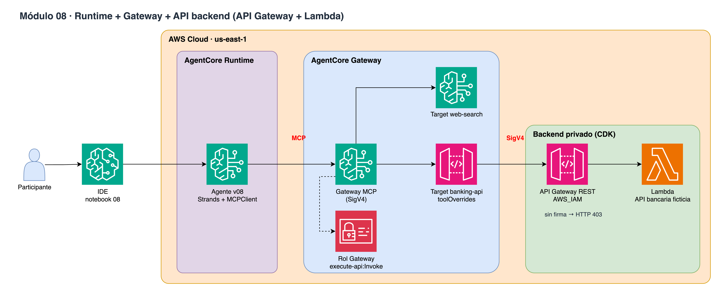

# Módulo 08 · 🏦 Runtime + Gateway + API backend

⏱️ **10 minutos** · La API REST del banco (API Gateway AWS_IAM + Lambda) se vuelve herramientas MCP con toolOverrides.



> Diagrama editable: [`assets/diagrams/08-runtime-gateway-api.drawio`](../../assets/diagrams/08-runtime-gateway-api.drawio) · Portal: sección **Módulo 08**.

## Archivos

- `08_runtime_gateway_api.ipynb` / `.py`
- `agent/agent_v08.py`

## Paso a paso

1. La API no es pública (HTTP 403 sin firma)
2. Target API Gateway stage + toolOverrides
3. Descubrir las tools MCP
4. Desplegar agente v08 (MCPClient)
5. Consultar productos y simular un CDT

## Cómo ejecutarlo

```bash
# Jupyter (VS Code / SageMaker Studio): abre el .ipynb y ejecuta celda por celda
# o como script desde la raíz del repo:
poetry run python workshop/08_runtime_gateway_api/08_runtime_gateway_api.py
```

Los recursos que crees se guardan en `workshop/.state.json` para el siguiente módulo y para `99_cleanup`.

# LICENSE

Copyright 2026 Santiago Garcia Arango
