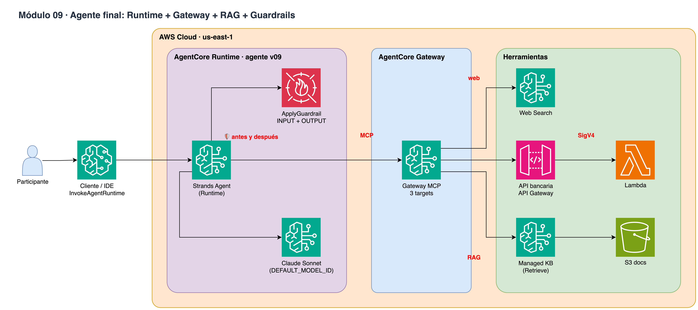

# Módulo 09 · 🦸 Runtime + Gateway + RAG + Guardrails

⏱️ **10 minutos** · Agente final: KB como tool MCP del Gateway + API + Web Search + ApplyGuardrail a la entrada y a la salida.



> Diagrama editable: [`assets/diagrams/09-final-agent.drawio`](../../assets/diagrams/09-final-agent.drawio) · Portal: sección **Módulo 09**.

## Archivos

- `09_runtime_gateway_rag.ipynb` / `.py`
- `agent/agent_v09.py`

## Paso a paso

1. Target connector bedrock-knowledge-bases
2. Un endpoint MCP con todas las tools
3. Desplegar agente v09 con guardrail como capa
4. Pregunta final API + RAG + Web
5. Ataques bloqueados en producción

## Cómo ejecutarlo

```bash
# Jupyter (VS Code / SageMaker Studio): abre el .ipynb y ejecuta celda por celda
# o como script desde la raíz del repo:
poetry run python workshop/09_runtime_gateway_rag/09_runtime_gateway_rag.py
```

Los recursos que crees se guardan en `workshop/.state.json` para el siguiente módulo y para `99_cleanup`.

# LICENSE

Copyright 2026 Santiago Garcia Arango
